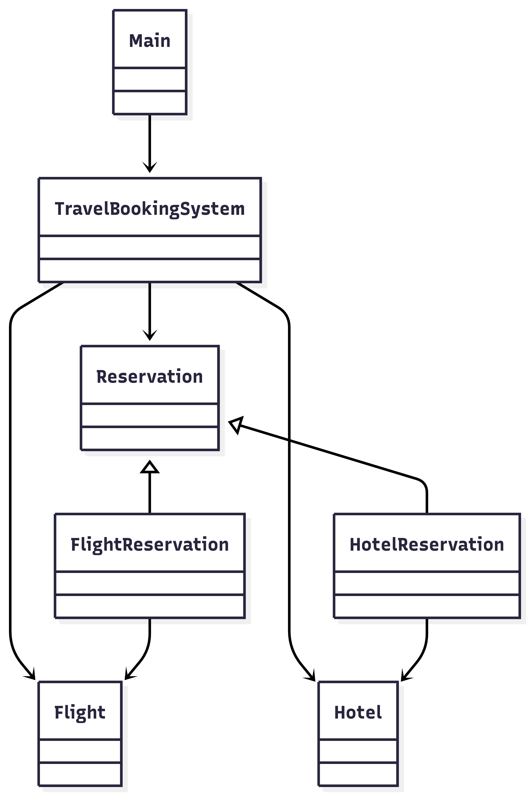

# Travel Booking System (Java Console Application)

## Deskripsi Program

Travel Booking System adalah aplikasi berbasis console (CLI) yang dibuat menggunakan Java untuk melakukan simulasi pemesanan penerbangan (Flight) dan hotel (Hotel).

Aplikasi ini memungkinkan pengguna untuk:
-   Mencari penerbangan berdasarkan asal, tujuan, dan tanggal
-   Memesan penerbangan
-   Mencari hotel berdasarkan lokasi, tanggal check-in/check-out, dan jumlah tamu
-   Memesan hotel
-   Melihat daftar reservasi
-   Membatalkan reservasi

Program ini juga mengimplementasikan beberapa konsep penting dalam pemrograman Java seperti OOP, koleksi, lambda expression, exception handling, dan sealed class.

----------

# Konsep Java yang Digunakan

## 1. Class dan Object

Program menggunakan beberapa class untuk merepresentasikan entitas dalam sistem:

-   Flight
-   Hotel
-   Reservation
-   FlightReservation
-   HotelReservation
-   TravelBookingSystem 
-   Main
   
Contoh pembuatan objek:
```
Flight flight = new Flight("GA-101", "JKT", "DPS", "2026-03-10", 10, 1500000, null);
```
## 2. Enkapsulasi

Setiap atribut pada class dibuat private dan hanya dapat diakses menggunakan getter dan setter.

Contoh:
```
private String flightNumber;

public String getFlightNumber() {
    return flightNumber;
}
```
## 3. Pewarisan (Inheritance)
Class FlightReservation dan HotelReservation mewarisi class abstrak Reservation.
```
public final class FlightReservation extends Reservation
```

## 4. Polimorfisme

Reservasi disimpan dalam satu list:
```
ArrayList<Reservation> reservations
```
Sehingga sistem dapat menyimpan berbagai jenis reservasi.
Ketika memanggil
```
r.display();
```
Java akan menjalankan metode sesuai tipe objek (FlightReservation atau HotelReservation).

## 5. Abstract dan Sealed Class
```
public sealed abstract class Reservation
    permits FlightReservation, HotelReservation
```
Sealed class membatasi subclass yang diizinkan.

## 6. ArrayList (Collections)
Program menggunakan ArrayList untuk menyimpan data:
```
ArrayList<Flight> flights
ArrayList<Hotel> hotels
ArrayList<Reservation> reservations
```
## 7. Lambda Expression
Digunakan saat menampilkan hasil pencarian.
```
results.forEach(System.out::println);
```

## 8. Pattern Matching (instanceof)

Digunakan saat membatalkan reservasi.

```
if (target instanceof FlightReservation fr) {
    Flight f = fr.getFlight();
}
```

## 9. Exception Handling
Input pengguna dibungkus dengan try-catch.
```
try {
    int choice = Integer.parseInt(sc.nextLine());
} catch (NumberFormatException e) {
    System.out.println("Invalid input.");
}
```

-----
# Desain Program

  

## Struktur Folder
```
/
Main.java
TravelBookingSystem.java

models/
  Flight.java
  Hotel.java
  Reservation.java
  FlightReservation.java
  HotelReservation.java
```
---
## Diagram UML



Class TravelBookingSystem bertanggung jawab untuk mengelola:
-   daftar penerbangan
-   daftar hotel
-   daftar reservasi

---
# Cara Menjalankan Program

### 1. Run
Jalankan perintah berikut di terminal:

```
java Main.java
```

---
# Tampilan Console
Saat program dijalankan, console akan menampilkan menu:

```
===== TRAVEL BOOKING SYSTEM =====
1. Search Flights
2. Book Flight
3. Search Hotels
4. Book Hotel
5. List Reservations
6. Cancel Reservation
0. Exit
```
Pengguna dapat memilih menu dengan memasukkan angka.

---
# Data Seeder
Agar fitur pencarian dapat menemukan data, sistem memiliki seed data pada method:

```
TravelBookingSystem.seedData()
```
Contoh data penerbangan
|   Flight Number.   |Origin     |Destination    |. Date        | Available Seats |
|-------------|-----------|---------------|--------------|---|
|GA-101|JKT            |DPS           |2026-03-10 | 10 |
|QZ-202|JKT            |SUB           |2026-03-11 |5 |
|JT-303|SUB            |DPS           |2026-03-10 |8 |
|ID-404|JKT            |DPS           |2026-03-10 |3 |


Contoh data Hotel
Hotel ID |   Hotel.   |Location     |Check-in    | Check-out |. Guest Count   |
|-------------|-----------|-------------|--------------|----|---|
|1|Bali Sunset|DPS            |2026-03-10 | 2026-03-12   |2 |
|2|Surabaya Inn|SUB            |2026-03-11  | 2026-03-12   |1 |
|3|Jakarta Stay|JKT           |2026-03-10  | 2026-03-11  |1 |
|4|Bali Budget|DPS           |2026-03-10  | 2026-03-12  |1 |

---
# Test Case / Pengujian
### Test Case 1 — Search Flight
Input:
```
Choose: 1
Origin: JKT
Destination: DPS
Date (YYYY-MM-DD): 2026-03-10
```
Output yang diharapkan:
```
GA-101 JKT->DPS 2026-03-10 seats:10 price:1500000.0
ID-404 JKT->DPS 2026-03-10 seats:2 price:1750000.0
```

---
### Test Case 2 — Book Flight
Input:

```
Choose: 2
Flight Number: ID-404
Passenger Count: 1
```
Output:
```
Booking successful!
=== Flight Reservation ===
Confirmation : D3ABD585
Flight       : ID-404
Route        : JKT -> DPS
Date         : 2026-03-10
Passengers   : 1
Price        : 1750000.0
```
---
### Test Case 3 — Search Hotel

Input:
```
Choose: 3
Location: DPS
Check-in Date (YYYY-MM-DD): 2026-03-10
Check-out Date (YYYY-MM-DD): 2026-03-12
Guest Count: 1
```
Output:
```
Hotel ID:4 | Bali Budget | DPS | Check-in:2026-03-10 | Check-out:2026-03-12 | Guests:1 | Price:650000
```
---
### Test Case 4 — Booking hotel
Input:
```
Choose: 4
Hotel ID: 4
```
Output:
```
Booking successful!
=== Hotel Reservation ===
Confirmation : D0B2ED24
Hotel        : Bali Budget
Location     : DPS
Check-in/out : 2026-03-10 -> 2026-03-12
Guests       : 1
Price        : 650000
```
---
### Test Case 5 — List Reservations
Input:
```
Choose: 5
```
Output:
```
=== Flight Reservation ===
Confirmation : 4720A270
Flight       : ID-404
Route        : JKT -> DPS
Date         : 2026-03-10
Passengers   : 1
Price        : 1750000.0
--------------------------
=== Hotel Reservation ===
Confirmation : ADAC9DBF
Hotel        : Bali Budget
Location     : DPS
Check-in/out : 2026-03-10 -> 2026-03-12
Guests       : 1
Price        : 650000
--------------------------
```
---
### Test Case 6 — Cancel Reservation
Input:
```
Choose: 6
Enter Confirmation Number: ADAC9DBF
```
Output:
```
Reservation cancelled.
```

---
### Test Case 7 — Exit
Input:
```
Choose: 0
```
Output:
```
Goodbye!
```
